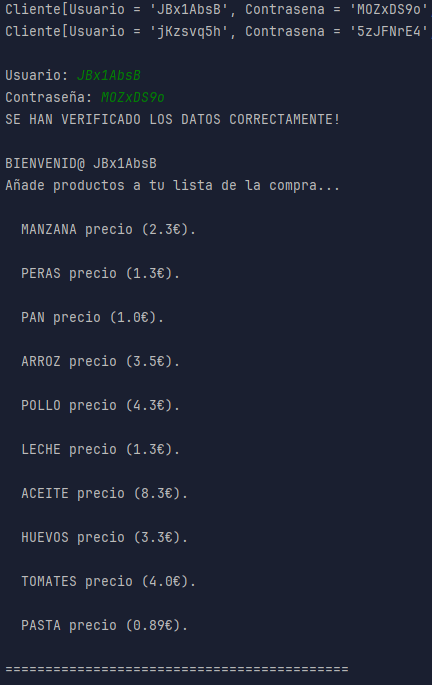
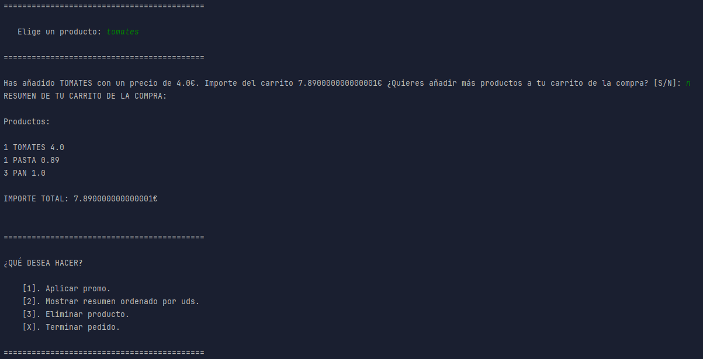
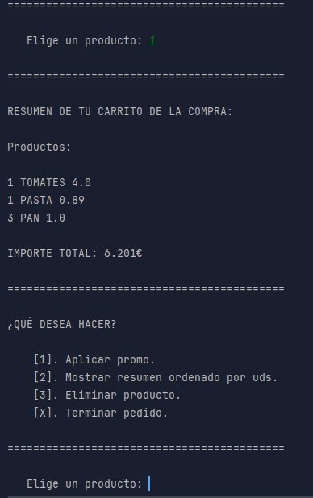
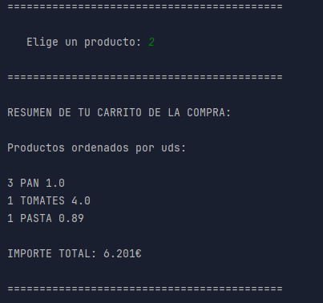
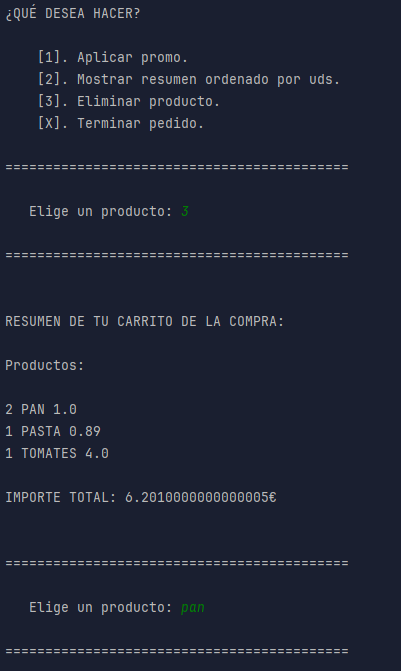
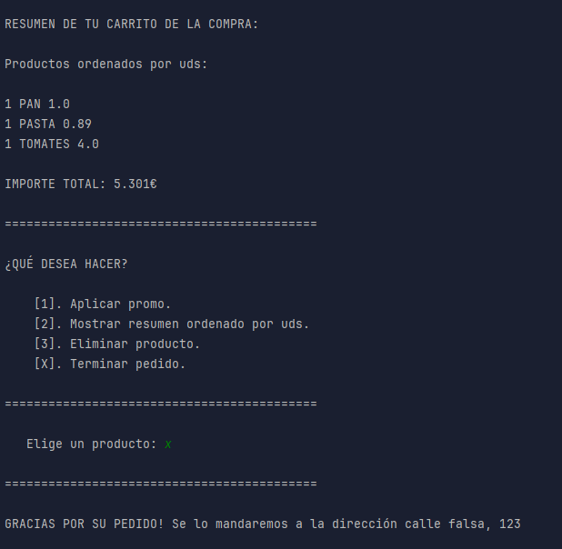

# Servicio de  compra online en MERCADAW

## Índice

1. [Resumen](#Resumen)
2. [Estructua de clases](#Estructura-de-clases)
    - [Diagrama UML](#diagrama-uml)
    - [Clase AppZonaClientes](#clase-appzonaclientes)
3. [Pruebas](#pruebas)
    - [Funcionamiento_correcto](#funcionamiento-correcto)
4. [Entrega](#entrega)

## Resumen
>Esta app consiste en implementar la funcionalidad de una compra online ficticia
> en "MERCADAW".

El programa se divide en 2 partes:
- La **App de Mantenimiento**.
- La **App Zona de Clientes** para autenticarse y realizar pedidos.

## Estructura de clases
>Utilizaremos Programación Orientada a Objetos **(POO)** y la siguiente estructura:

### Diagrama UML

 

### Clase AppZonaClientes
> [!NOTE]
> Los usuarios y contraseñas se generan de forma aleatoria para simplificar los registros. 
> Además se muestran por pantalla para tenerlos disponibles.

```Java

public class AppZonaClientes {

   static Scanner entrada = new Scanner(System.in);

   //Cliente sobre el que vamos a trabajar
   static Cliente cliente;

   //Variable que controla la cantidad de intentos de inicio de secion maximos.
   static final int INTENTOS = 3;

   public static void main(String[] args) {

      //Declaramos, generamos e imprimimos los clientes
      Mercadaw mercadaw = new Mercadaw();

      mercadaw.generarClientes();
      mercadaw.generarClientes();

      mercadaw.imprimirClientes();
      System.out.println();

      //Comprobamos sus credenciales
      autenticacion(mercadaw.getClientes());
      System.out.println();

      //Comenzamos con la compra.
      menu();

   }

   public static void autenticacion(Set<Cliente> listaClientes){

      int cont = 0;

      do {
         //Pedimos usuario y contraseña
         System.out.print("Usuario: ");
         String usuario = entrada.next();

         System.out.print("Contraseña: ");
         String contra = entrada.next();
         
         boolean encontrado = false;

         //Buscamos el cliente en la lista
         for (Cliente c : listaClientes) {

            //Si lo encontramos, nos guardamos el cliente y salimos del bucle.
            if (c.getUsuario().equals(usuario) && c.getContrasena().equals(contra)) {

               cliente = c;
               encontrado = true;
               break;

            }
         }

         //En caso de haberlo encontrado imprimimos un mensaje e iniciamos la compra.
         if (encontrado) {
            System.out.println("SE HAN VERIFICADO LOS DATOS CORRECTAMENTE!");
            System.out.println();
            AppZonaClientes.iniciarCompra();
            break;

            //En caso de no haberlo encontrado, sumamos 1 al contador y repetimos.
         }else {

            System.out.println("Algo no coincide o no existe! Vuelve a intentarlo...");
            cont++;

            //Cuando llegamos al numero maximo de intentos, salimos del programa.
            if(cont == INTENTOS){

               System.err.println("ERROR DE AUTENTICACIÓN");
               System.exit(0);

            }
         }
      } while (cont < INTENTOS);
   }

   public static void iniciarCompra (){

      //Creamos el pedido e imprimimos la lista de productos.
      cliente.crearPedido();
      imprimirProductos();

   }

   public static void imprimirProductos(){

      double carrito = 0;
      boolean llave = true;

      //Imprimimos la lista de pruductos y precios.
      System.out.println("BIENVENID@ " + cliente.getUsuario());
      do {
         System.out.println("Añade productos a tu lista de la compra...");

         for(Producto producto : Producto.values()){

            System.out.println("\n  " + producto.name() + " precio (" + producto.getPrecio() + "€).");

         }

         //Elegimos una opcion.
         String eleccion = opcion();

         //Con la opcion se recorre la lista de productos y en caso de encontrarlo se calsula el precio de la cesta.
         try {
            for (Producto producto : Producto.values()){
               if(Producto.valueOf(eleccion).equals(producto)){

                  carrito += producto.getPrecio();

                  cliente.importePedido(carrito);

                  cliente.insertarProducto(producto.name());

                  //Imprimimos el total y preguntamos que queremos hacer.
                  System.out.print("Has añadido " + producto.name() + " con un precio de " + producto.getPrecio() + "€. Importe del carrito " + carrito +
                          "€ ¿Quieres añadir más productos a tu carrito de la compra? [S/N]: ");

                  String opcion = entrada.next().toUpperCase();
                  entrada.nextLine();

                  switch (opcion){
                     //Si queremos comprar mas productos actualizamos el carrito y repetimos el bucle
                     case "S":
                        cliente.getPedido().setImporte_total(carrito);
                        break;
                     //Si queremos terminar el pedido cambiamos nuestro booleano , mostramos el resumen y salimos del bucle
                     case "N":
                        cliente.getPedido().resumenCompra();
                        llave = false;
                        break;
                     default:

                        System.out.println("Opcion no reconocida!  vuelve a intentarlo.");
                        System.out.println();
                        break;
                  }
               }
            }
            //Con esto controlamos que al introducir un producto que no esta en la lista el programa no explota.
         } catch (IllegalArgumentException e) {
            System.out.println("ERROR, EL PRODUCTO INDICADO NO EXISTE!! Porfavor, vuelve a intentarlo.");
            System.out.println();
         }
      } while (llave);
   }

   public static void menu(){

      boolean llave = false;

      //Imprimimos las opciones
      do {
         System.out.println("===========================================");
         System.out.println();

         System.out.println("¿QUÉ DESEA HACER?");
         System.out.println();
         System.out.println("    [1]. Aplicar promo.");
         System.out.println("    [2]. Mostrar resumen ordenado por uds.");
         System.out.println("    [3]. Eliminar producto.");
         System.out.println("    [X]. Terminar pedido.");

         String opcion = opcion();

         switch (opcion){
            case "1":
               //Si las promociones ya se ha aplicado no hace nada.
               if (cliente.isPromociones()){

                  System.out.println("YA HAS APLICADO TUS PROMOS");
                  System.out.println();

                  //Si no, las aplicamos y mostramos el nuevo precio
               }else{

                  cliente.getPedido().aplicarPromo3x2();
                  cliente.getPedido().aplicarPromo10();
                  cliente.setPromociones(true);
                  cliente.getPedido().resumenCompra();

               }
               break;
            //Con esta opcion se muestran los productos ordenados por unidades
            case "2":
               cliente.getPedido().resumenOrdenado();
               break;
            //Con esta opcion se pueden eliminar oproductos
            case "3":
               System.out.println();

               //Mostramos los productos del pedido
               cliente.getPedido().resumenCompra();

               //Guardamos un producto y lo eliminamos.
               String producto = opcion();
               cliente.eliminarProducto(producto);
               break;
            //Por ultimo salimos del programa.
            case "X":
               cliente.terminarpedido();
               llave = true;
               break;
            default:
               System.out.println("Opcion no reconocida! Vuelve a intentarlo.");
               System.out.println();
               break;
         }
      } while (!llave);
   }

   public static String opcion(){

      //Metodo para escoger
      System.out.println();
      System.out.println("===========================================");

      System.out.print("\n   Elige un producto: ");
      String eleccion = entrada.next().toUpperCase();
      entrada.nextLine();

      System.out.println();
      System.out.println("===========================================");
      System.out.println();

      return eleccion;
   }
}
```

## Pruebas

### Funcionamiento correcto
- **Introducimos usuario y contraseña y llenamos el carrito con 3 panes, 1 pasta y 1 tomate**



- **Aplicamos las promociones**



- **Ordenamos por unidades**



- **Eliminamos pan**



- **Dejamos solo 1 pan y salimos *(precio recalculado)***



## Entrega

- [x] **Código Fuente**: [Github](https://github.com/Csar-46/Java---DAW/tree/main/Extructuras/src/main/java/org/example/mercadaw)
- [x] **Vídeo Demo**: [Github](vid/unknown_2025.04.04-11.48.mp4)